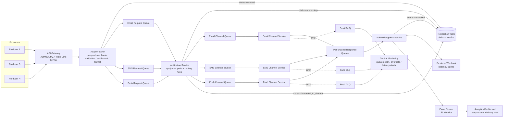

# Notification Service — High Level Design

A reusable interview-prep writeup based on a real production notification platform (centralized, multi-channel, multi-tenant). Use this as the script to follow in an HLD interview.

---

## 1. Interview Structure (the script to follow)

1. Clarify functional requirements
2. Clarify non-functional requirements / constraints (this drives the rest of the design)
3. Capacity estimation (back-of-envelope)
4. High-level architecture (components + data flow)
5. Deep dive: API contract + data model
6. Deep dive: idempotency, retries, dead-letter handling
7. Deep dive: state machine + concurrency control
8. Deep dive: SLA tiers / multi-tenancy / rate limiting
9. Deep dive: disaster recovery
10. Deep dive: data retention & compliance
11. Cost optimization
12. Testing strategy
13. Security
14. Wrap-up: tradeoffs and what you'd do differently at 10x scale

---

## 2. Functional Requirements

- FR1: Expose an interface (API and/or MQ) through which producers submit notification requests.
- FR2: Support multiple delivery channels — Email, SMS, Push/App notification — selected based on event type + user preferences.
- FR3: Apply user preference / opt-out rules before sending.
- FR4: Retry on transient failure (own service layer **and** downstream channel provider layer).
- FR5: Dead-letter queue (DLQ) per service after retry exhaustion.
- FR6: Track delivery status end-to-end (received → processing → forwarded → sent/failed → acknowledged).
- FR7: Idempotency — never send the same logical notification twice, even under retries/replays.
- FR8: (Explicitly out of scope at the notification-service layer) — message aggregation/digesting of multiple notifications to the same user. That belongs upstream at the producer/aggregation layer. Notification service is fire-and-forget + reliable delivery, not a digesting engine.

## 3. Non-Functional Requirements

- NFR1: Scale — handle 100K+ events/day today, design to scale to 1M–1B/day.
- NFR2: Low latency per channel (see SLA tiers, §8).
- NFR3: High availability or, at minimum, **no silent data loss** (durability > raw availability for financial use cases like margin calls).
- NFR4: Idempotency end-to-end.
- NFR5: Observability — central logging (e.g. ELK/Splunk) + central monitoring/alerting on queue depth, error rate, latency.
- NFR6: Multi-tenant isolation — one producer's load/failure should not affect another's.
- NFR7: Auditability for regulated notifications (margin calls, trade confirms).

## 4. Capacity Estimation (how to derive the complexity budget)

Rule of thumb: assume ~10^8–10^9 simple ops/sec available per machine/service when reasoning about algorithmic complexity inside a single request. For system capacity, reason in **throughput**, not single-request complexity:

- 100K events/day ≈ ~1.2 events/sec average — trivial.
- Peak traffic is what matters: assume 10–50x average burst (e.g. market-open, EOD reports, margin call storms) → design for ~50–100 events/sec sustained burst, with headroom to 1000+ events/sec per tier.
- At 1M events/day → ~12 events/sec average, ~500–1000/sec burst.
- At 1B events/day → ~12K events/sec average — now you're in "dedicated infra per tier, horizontally scaled consumers, partitioned queues" territory.

**General algorithmic framing (useful for the LLD portion of the same interview):**
| n (input size) | Budget (ops, @10^8/sec, ~1 sec limit) | Complexity that fits |
|---|---|---|
| 10^3 | 10^8 | O(n^3) fine |
| 10^4 | 10^8 | O(n^2) borderline |
| 10^5 | 10^8–10^9 | O(n log n), not O(n^2) (n^2=10^10 → timeout) |
| 10^6+ | 10^8–10^9 | O(n) or O(n log n) only |

log2(10^5) ≈ 17, so n log n at n=10^5 ≈ 1.7M ops — comfortably fast. n^2 at n=10^5 = 10^10 ops — too slow (~100s).

## 5. High-Level Architecture

**Flow:** Producers → Adapter → Notification Service → Channel Services (Email/SMS/Push) → Acknowledgment Service → Producer webhook (optional).



**Component responsibilities:**

| Component | Responsibility |
|---|---|
| API Gateway | AuthN/AuthZ, tier-based rate limiting (via distributed limiter, e.g. Redis), routes to Adapter |
| Adapter | Producer-specific validation (DB lookups, entitlement checks, attachment handling); generic adapter w/ pluggable hooks for the 80% common case, custom adapter for the 20% bespoke case; generates/owns the canonical `notification_id`; writes initial DB row |
| Notification Service | Reads channel-agnostic request, applies user preferences + business rules, decides channel, forwards to channel queue |
| Channel Services (Email/SMS/Push) | Talk to third-party providers; own their internal retry; must be idempotent on `notification_id` |
| Acknowledgment Service | Reads channel response queues, updates final status, fires producer webhook, emits analytics event |
| Monitoring/Alerting | Watches queue depth, error rate, latency across all services; pages support on threshold breach |
| Central Logging (ELK) | All services ship logs/events here; query by `notification_id` for full timeline debugging |

## 6. API + Data Model

### Producer-facing request contract (standardized; producer-specific needs go in `metadata`)

```json
POST /v1/notifications
{
  "producer_event_id": "string (producer-supplied, must be unique per producer — required)",
  "tier": "urgent | high | normal | low",        // fixed at onboarding, not per-request
  "event_type": "margin_call | trade_confirm | eod_report | ...",
  "recipient": { "user_id": "string" },
  "channel_hint": "email | sms | push | null",   // optional override; default = user preference engine
  "payload": { "...": "channel-specific content" },
  "metadata": { "...": "producer-specific extras (e.g. attachment_ref, callback_url)" }
}

Response: 200 OK
{ "notification_id": "uuid", "status": "received" }
```

### Notification table (source of truth)

| Column | Type | Notes |
|---|---|---|
| notification_id | UUID (PK) | generated by Adapter, **not** the producer's event id — keeps internal system decoupled from any single producer's ID scheme |
| producer_id | string | for tenant isolation / analytics |
| producer_event_id | string | correlation id, used by Adapter to dedupe producer-side retries |
| tier | enum | urgent/high/normal/low — fixed at onboarding |
| channel | enum | email/sms/push |
| status | enum | received → processing → forwarded_to_channel → sent → acknowledged (or → failed) |
| version | int | optimistic-locking column |
| created_at / updated_at | timestamp | |
| payload_ref | string | pointer to payload (avoid storing large/sensitive blobs inline) |

Partitioning: **weekly** partitions — balances partition-count overhead (52/yr, manageable) against deletion/query granularity (daily = too many tables to manage; monthly/yearly = partitions too large, slow targeted deletes).

## 7. Idempotency, Retry, DLQ

- **Idempotency key = `notification_id`**, generated once by the Adapter and threaded through the *entire* workflow (not the transport-level MQ message ID, which changes at every hop, and not the producer's own ID scheme, since you can't standardize across many producers).
- Adapter dedupes producer-side retries using `producer_event_id` → looks up existing `notification_id` before minting a new one.
- Retries exist at **multiple independent layers**:
  - MQ/transaction-manager level (infra-provided backoff; only commit/ack the inbound message once the outbound write fully succeeds)
  - Notification Service level (rule engine / preference lookup failures)
  - Channel Service level (third-party provider's own retry, opaque to us)
- After N configured retries at any layer → message goes to **that service's own DLQ** (no shared/central DLQ — each service has its own contract, can't unify the schema).
- Channel services **must** dedupe incoming sends on `notification_id` — because on replay, Notification Service may not know if a message reached "sent" and will default to resending.

## 8. State Machine + Concurrency

States: `received → processing → forwarded_to_channel → sent/failed → acknowledged`

- Multiple services (Adapter, Notification Service, Acknowledgment Service) write to the same notification row → use **optimistic locking** via the `version` column, not table/row locks (avoids contention/latency at scale):
  ```sql
  UPDATE notification SET status='processing', version=version+1
  WHERE notification_id = ? AND version = ?
  ```
- On version mismatch: don't blindly retry — first validate the **state transition** is legal (e.g. `processing → sent` is valid; `sent → processing` is not). Illegal transitions = log + alert, not silent retry, since they usually indicate a real ordering/race bug rather than benign contention.
- Realistic race scenario: a retried/duplicate message causes two concurrent workers to read the same version and race to write — not the "happy path," but a real failure-injected scenario worth naming explicitly in an interview.

## 9. SLA Tiers & Multi-Tenancy

- Internal platform serving many business units with very different criticality (margin call ≈ minutes, doc-expiry ≈ hours, EOD reports ≈ best-effort before close).
- **Tier is fixed at onboarding, not chosen per-request** — otherwise every producer marks everything "urgent" and the tier becomes meaningless.
- Each tier gets **dedicated infra**: separate queues, separate consumer pools, separate DB capacity — so a normal-tier traffic spike never degrades urgent-tier latency.
- Enforcement point: **API Gateway** does tier-based rate limiting via a distributed limiter (e.g. Redis-backed token bucket) so it works correctly across multiple horizontally-scaled gateway instances.
- Gateway stays **async**: it validates + rate-limits + returns `notification_id` immediately, then writes to the queue — producer is not blocked on actual delivery.

## 10. Disaster Recovery

- DB primary failure:
  - Fast path: master–replica failover (replica promotes); brief write-unavailability window, callers should retry with backoff, queues absorb backpressure.
  - Slow path: full restore from backup (e.g. ~30 min depending on data size) — no data loss because **inbound queues keep buffering**; messages aren't lost, just delayed.
- Recovery/replay uses the **status column** to know exactly where to resume:
  - `received` → Adapter never got picked up by Notification Service → replay from Notification Service.
  - `processing` → Notification Service started but never confirmed forwarding → replay from Notification Service.
  - `forwarded_to_channel` → may or may not have reached the channel provider → channel service **must dedupe on `notification_id`** since we genuinely don't know if it already sent.
  - `sent`/`acknowledged` → terminal, never replay.
- This is the same idempotency mechanism as §7, just invoked for DR instead of normal-path retries.

## 11. Data Retention & Compliance

- Hot tier: last ~3 months, live weekly-partitioned DB table.
- Warm tier: 3–12 months, archived to cold storage via weekly job.
- Cold/expired: drop partitions entirely after 1 year (no indefinite/7-yr retention today — flag this as a gap vs. potential regulatory requirement and something to confirm with compliance for financial use cases).
- GDPR-style deletion request handling (if required):
  1. Deletion request logged in its own table.
  2. Scheduled job deletes from active partitions directly (`WHERE user_id = ?`, scoped to relevant weekly partitions).
  3. For archived/cold data: either (a) restore → delete → re-archive, or (b) mark "logically deleted" without physical removal (cheaper, common compromise).
  4. Keep an audit log of what was deleted and when.
- Partition granularity tradeoff (be ready to justify weekly vs. daily/monthly/yearly): weekly balances partition-management overhead against deletion/query granularity and performance.

## 12. Cost Optimization

- Hot/warm/cold data tiering (see §11) — don't pay premium DB cost for data nobody queries live.
- Predictive scaling based on historical/seasonal patterns (e.g. known high-volume periods like market events, year-end) — pre-scale ahead of expected spikes, scale back down after, rather than over-provisioning permanently.
- Per-tier dedicated infra (§9) sized to that tier's actual contracted volume — avoids one-size-fits-all overprovisioning.

## 13. Testing Strategy

- Unit tests per service.
- Integration tests across the full chain (Adapter → Notification Service → Channel → Ack).
- **Load/performance testing**: ramp traffic (e.g. 100 → 1000 → 1500 msg/sec) and find where p99 latency crosses the SLA budget — that crossing point is your *current* capacity ceiling, not a fixed number. Report results as "at X msg/sec, component Y is the bottleneck at Z% utilization," not just a single throughput claim — and test the *whole stack scaling together*, not one service in isolation.
- SLA budget derivation: business/product defines the end-user-facing SLA (e.g. push ≈ seconds, email ≈ minutes, SMS ≈ under a minute) for an external-facing product; for an **internal multi-tenant platform**, producers/business-units define their own SLA per tier based on their criticality (margin call vs. EOD report) — engineering then decomposes that into per-component latency budgets and validates against them.
- Chaos engineering: kill a service mid-processing, drop the DB, inject network latency — verify retries/replay/DLQ actually behave as designed under real failure, not just on paper.
- Canary deployments for safe rollout of changes.

## 14. Security

- Webhook calls back to producers: signed payloads (HMAC with a per-producer shared secret) so the producer can verify authenticity.
- Tenant isolation: every query/log access scoped by `producer_id`; no cross-producer data visibility.
- Sensitive data: this particular system relies on **IAM/service-principal access control + audited log access** rather than field-level encryption-at-rest — a pragmatic choice for the current risk profile, not a universal best practice. Call this out explicitly as a tradeoff in interview, and note that encryption-at-rest would be added if a compliance regime (PCI-DSS, HIPAA-equivalent) required it.

---

## 15. FAQs / Edge Cases (likely interviewer follow-ups)

**Q: Why generate your own `notification_id` instead of using the producer's event ID?**
A: With multiple producers, each may have a different ID scheme that can change independently. Owning your own ID keeps the notification service decoupled; the producer's ID becomes just a correlation field used for producer-side dedup at the Adapter.

**Q: Why not centralize all DLQs / response queues into one shared queue?**
A: Each channel service has a different contract/schema. A shared queue would force a lowest-common-denominator format and couple unrelated services together. Keep them separate; centralize only cross-cutting concerns like monitoring and logging.

**Q: How do you handle a producer who suddenly claims their normal-tier traffic is "urgent"?**
A: You don't honor it dynamically — tier is a contract fixed at onboarding with provisioned, isolated infra. Changing tier requires a capacity-planning conversation, not a request-time flag.

**Q: Two services both try to update the same notification row at nearly the same time — what actually happens?**
A: This isn't the happy path (Notification Service and Ack Service normally update at different times) — it happens under retries/timeouts/replay, where a duplicate in-flight message races a "real" update. Optimistic locking via the `version` column catches it: the losing write's `WHERE version=?` matches zero rows, and the caller re-reads and either retries or, if the *state transition itself* is invalid (e.g. going backwards), logs/alerts instead of blindly retrying.

**Q: Notification Service forwarded to the channel queue but crashed before writing `forwarded_to_channel` status — what happens on replay?**
A: Notification Service will not know whether the channel service already received it, so by default it resends. This is exactly why **channel services must be idempotent on `notification_id`** — they silently no-op a duplicate rather than double-sending the user.

**Q: Why can't every producer's preprocessing logic be standardized into the generic adapter?**
A: Roughly 80% of producers fit common patterns (DB validation, entitlement check, attachment handling) and can use a generic adapter with pluggable hooks. The remaining ~20% have genuinely unique workflows that can't be predicted upfront — those get a custom adapter, built by the platform team (in this design) for speed-to-market and long-term quality control, at the cost of owning that maintenance burden long-term.

**Q: Does the API Gateway make the system synchronous?**
A: No — the gateway does synchronous AuthN/rate-limit/validation only, returns `202`-style ack with `notification_id` immediately, and writes to the queue asynchronously. Actual delivery remains fully async.

**Q: Won't the API Gateway become a single point of failure/bottleneck?**
A: Scale it horizontally behind a load balancer; use a distributed rate limiter (e.g. Redis) so tier limits are enforced consistently across all gateway instances rather than per-instance.

---

## 16. Tradeoffs to mention proactively in the interview

- Durability over raw availability for financial-criticality notifications (margin calls) — better to delay than to lose.
- Custom adapters owned by the platform team trade engineering effort for speed-to-market and quality control, at the cost of long-term ownership burden.
- IAM-based access control instead of field-level encryption-at-rest is a deliberate, current-state tradeoff — not a recommendation for every system.
- One year hard data-retention cutoff is a gap relative to potential 7-year regulatory retention requirements in finance — worth flagging as something you'd revisit with compliance, not glossing over.