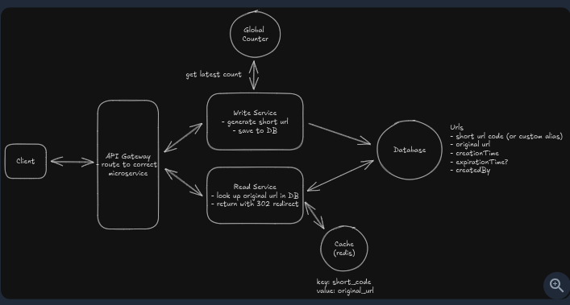

# Functional Requirements 
- users can create short url for a original  url 
    - OPTIONAL : CUSTOM ALIAS
    - OPTIONAL : EXPIRY DATE 
- users can access the original url by visiting the short url

# Non Functional Requirements
- unique short urls being generated 
- low latency redirection ~ 100ms
- Availability >> consistency
    - (Availability 99.99% - a max of 52.6 mins of downtime per year) 
- Scalability : 1B short urls and 100M DAU


# Core Entities 
- The original url 
- Short URL 
- User

# API
- POST /url : create a new resource
- PUT /url : update existing resource 
- DELETE /url : delete an existing resource 
- GET /url : get a resource 


```json
// Shorten a URL
POST /urls
{
  "long_url": "https://www.example.com/some/very/long/url",
  "custom_alias": "optional_custom_alias",
  "expiration_date": "optional_expiration_date"
}
->
{
  "short_url": "http://short.ly/abc123"
}
```
```json
// Redirect to original URL
GET /{short_url}
->
HTTP/302 Redirect
Location: https://www.example.com/some/very/long/url
```

# High level design


# Deep dives
1. Appproaches to create short URL 
    1.1 *Use first N chars* -> high chances of clash 
    1.2 *Use hash function on original url* -> convert that to base 62 -> 8 chars in base 62 can havd 62^8 ~ 218 trillion possible codes , 7 charcs = 3.5 trillions , 62 ^ 6 ~ 56 billion codes
    -> Still chances of collision -> handle collision using UNIQUE constraint on short code column 
    1.3 *Unique counter with base 62 encoding*
    -> Use unique counter -> convert that to base 62 -> 8 chars in base 62 can havd 62^8 ~ 218 trillion possible codes , 7 charcs = 3.5 trillions , 62 ^ 6 ~ 56 billion codes
    - Unique counter using redis counter ( single threaded and fast ) -> REDI can give a batch of counters to servers and next batch would be fetched by next time.
2. How to make redirect fast 
    2.1 Indexing on short code
        O(logN) lookup -> still slow , consider 100 DAU -> 5 redirect per user -> 500 M redirects per day -> 500M/86400 per sec -> 6k per second -> but it would be 100x more in peak time ~600k read per second -> SSD will suffer look below 
        Memory access time is 100 ns (0.0001ms) -> support millions of read per sec
        SSD access time 0.1 ms - support upto 0.1M read per sec
        HDD access time 10 ms -> support 100-200 i/ op per sec
     2.2 *Using redis like distributed cache* 
          can support up to millions of i/o operations per sec
        *Challenges*
        - Cache invalidation - on deletion/updates -> this is a read heavy application hence challenges are less
        - Warming up cache as we load new url from DB
     2.3 *Using CDN and Edge Computing* 
        - CDN to cache mapping -> redirect   closer to user location 
        *Challenges* 
        - Cache invalidation 
        - debugging difficult 
        - costlier

# Db estimates
URl : 100 bytes 
short code 8 bytes
custom alias 100 bytes
metadat - expiry , creation time etc 
Total ! 500 bytes approx 
1Bn URL -> 500 x 1B row = 500 GB -> SSD can store

### What DB to use 
Assuming 100k new url per day ~ 1 row per sec -> any Db can handle -> postgres to keep it simple 

### Handling DB failures 
1. DB Replication - Master slave to handle read traffic 
2. Database Backup- periodic snapshot 

# Servers 
We have read heacy app -> hence separate out read and write servers -> scale independently


# Addition for Staff+ 
- Multi region deployment 
    - Read heavy app (~100:1)  - reduces network latency    - 
- Counter range allocation 
    - single redis INCR creates single point of failure
    - Maintain a central coordinator like ZK or etcd -> allots ranges 1000000 - 2000000 to write servers 
        - event if server goes down we will loose some counters thats fine as we have trillions of records with 7 chars
- Redis failovers 
    Redis handling 99% of read traffic -> redis down -> cache stampe -> DB load -> db failovers 
    Solution : 
        - Redis cluster /Sentiner : master -replica arhcitcture  handles failovers or 
        - L1 loccal in-memory cache at app servers -> 1000 viral urls to survive redis outage
        - Locking on cache miss -> Districbuted locck that only one request reach DB to fetch data until cache is populated
- Security concerns around predictable short codes and mitigations 
    - First these are public urls anyways 
    - Obfuscate linear counters throuhh some cipher or algoruthm to randimize 
    - Rate limiting 
    - Protect links using optional password protection 
- Custom Alias collision prevention 
    - DB unique constraint
    - Bloom filter -> rejecting claimed aliases in memory immediately
- URL expiration clean strategies 
    - Passive deltion (On read / lazy cleanup )
    - Check expiry on access -> if expired remove it -> update DB 
    - Periodic cleanup job -> run every hour / day depending on load to remove expired urls 
        NoSQL DB like dynamoDb/MongoDB support TTL (time to live) -> expire items automatically after a specified time
    
